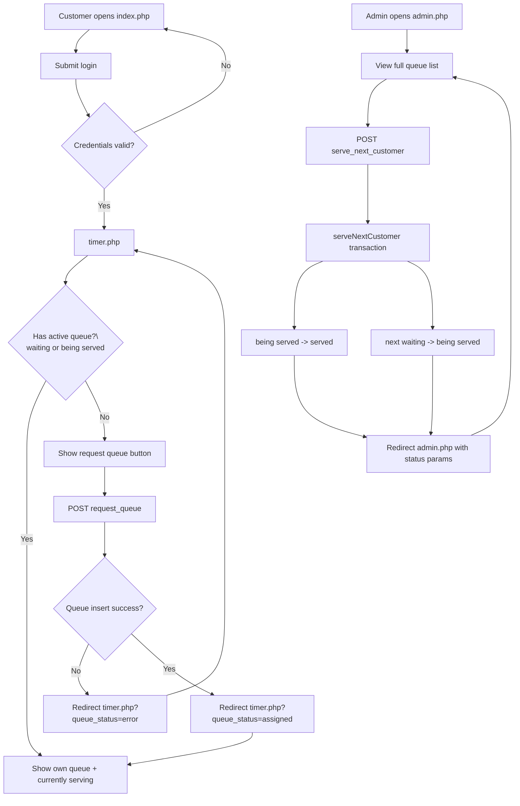

# prototype-auto-queue

This is a prototype queueing system with customer login, queue assignment, and admin-serving controls.

## System Overview

The application is a PHP + MySQL queue workflow with these core pages:

- `index.php` – login page for customers.
- `timer.php` – customer queue page (request queue number and view current status).
- `admin.php` – admin dashboard to view all queue rows and advance service.
- `create-account.php` – admin account creation page.
- `database.php` – shared database connection and queue/user helper functions.
- `style.css` – shared minimalist UI styles used across pages.

### Queue Status Lifecycle

Queue items move through these statuses:

1. `waiting` – customer is in line and not yet being served.
2. `being served` – customer is currently being served.
3. `served` – customer service is complete.

Only one queue row should be in `being served` at a time.

## High-Level Flow

### Customer side

1. Customer logs in at `index.php`.
2. Customer opens `timer.php`.
3. If the customer has no active queue (`waiting` or `being served`), they can request a queue number.
4. New queue row is inserted with `status='waiting'`.
5. Customer can see:
   - their own queue details, and
   - the currently served queue number.

### Admin side

1. Admin opens `admin.php` to view all queue rows.
2. Admin clicks **Mark Served Customer**.
3. `serveNextCustomer()` runs in a DB transaction:
   - current `being served` row is moved to `served`,
   - next `waiting` row is promoted to `being served`.
4. Admin sees updated status messages and refreshed queue state.

## Flowchart

## Data/Function Notes

- `getQueueNumber($username)` inserts a new queue row and returns the queue number or `false`.
- `checkDuplicateQueue($username)` treats both `waiting` and `being served` as active.
- `getCurrentlyServingQueueNumber()` returns the queue number in `being served` (or `null`).
- `serveNextCustomer()` handles queue advancement atomically and returns served/promoted queue numbers.
